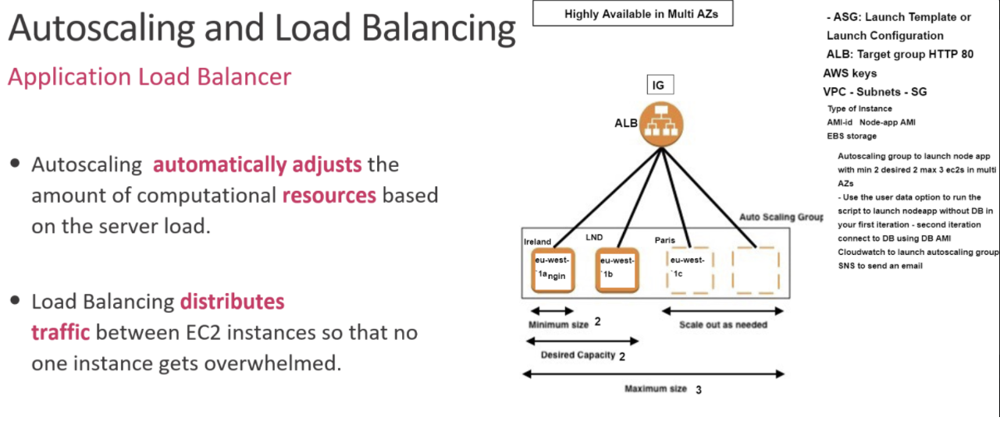

# Cloud Computing
- Cloud computing is the delivery of on-demand computing services -- from applications to storage and processing power -- typically over the internet and on a pay-as-you-go basis.

## Amazon Web Services (AWS)
- Amazon Web Services (AWS) is the world’s most comprehensive and broadly adopted cloud platform, offering over 200 fully featured services from data centers globally. Millions of customers—including the fastest-growing startups, largest enterprises, and leading government agencies—are using AWS to lower costs, become more agile, and innovate faster.

### AWS Global Infrastructure
- The AWS Global Cloud Infrastructure is the most secure, extensive, and reliable cloud platform, offering over 200 fully featured services from data centers globally. Whether you need to deploy your application workloads across the globe in a single click, or you want to build and deploy specific applications closer to your end-users with single-digit millisecond latency, AWS provides you the cloud infrastructure where and when you need it.

### AWS Regions
- AWS has the concept of a Region, which is a physical location around the world where we cluster data centers. We call each group of logical data centers an Availability Zone. Each AWS Region consists of multiple, isolated, and physically separate AZs within a geographic area. 

### AWS Availability Zones (AZs)
- An Availability Zone (AZ) is one or more discrete data centers with redundant power, networking, and connectivity in an AWS Region. AZs give customers the ability to operate production applications and databases that are more highly available, fault tolerant, and scalable than would be possible from a single data center.

### Public cloud - Private Cloud and Hybrid Cloud use cases
- IaaS : Infrastructure as a Service examples are DigitalOcean, Linode, Rackspace, Amazon Web Services (AWS), Cisco Metapod, Microsoft Azure, Google Compute Engine (GCE).
- PaaS : Platform as a Service examples are AWS Elastic Beanstalk, Windows Azure, Heroku, Force.com, Google App Engine, Apache Stratos, OpenShift.
- SaaS : Software as a Service examples are Google Workspace, Dropbox, Salesforce, Cisco WebEx, Concur, GoToMeeting.
  
- Cloud Data Centers: With a cloud data center, the actual hardware is managed and run by the cloud company in question, often with the help of a third-party managed services provider. Clients then run their applications and manage their data within a virtual infrastructure that runs on the cloud servers.

## AWS Services
- Elastic Compute Cloud `EC2` : Amazon Elastic Compute Cloud (Amazon EC2) is a web service that provides secure, resizable compute capacity in the cloud. It is designed to make web-scale cloud computing easier for developers. Amazon EC2’s simple web service interface allows you to obtain and configure capacity with minimal friction. It provides you with complete control of your computing resources and lets you run on Amazon’s proven computing environment.
- Simple Storage Service `S3` : Amazon Simple Storage Service (Amazon S3) is an object storage service offering industry-leading scalability, data availability, security, and performance. Customers of all sizes and industries can store and protect any amount of data for virtually any use case, such as data lakes, cloud-native applications, and mobile apps. With cost-effective storage classes and easy-to-use management features, you can optimize costs, organize data, and configure fine-tuned access controls to meet specific business, organizational, and compliance requirements.
- Virtual Private Network `VPC` : 
- Internet Gateway `IG`
- Route Tables `RT`
- Subnets `sn`
- Network Access Control `NACLs`
- Security Groups `SG`
- Cloudwatch `CW`
- Simple Notification Service `SNS`
- Simple Queue Service `SQS`
- Load Balancers `LB` - Application `ALB` - Elastic `ELB` - Network `NLB`
- Autoscaling Groups `ASG`
- Amazon Machine Image `AMI`
- Dynamodb -Mongodb

# Launch ec2 instance

- ssh debugging
```
eval ssh-agent

ssh-add "keyfile.pem"
```
- update and upgrade system
- install nginx
- nginx enabled
- check the public ip globally
```
  sudo apt-get update -y
  sudo apt-get upgrade -y
  sudo apt-get install nginx -y
  sudo apt-get update -y
  sudo systemctl restart nginx
  sudo systemctl enable nginx
```
## 2 tier app deployment on the AWS


#### Setting up new AWS ec2 instance.
- Make sure to be logged in and have location set to ireland
- Setting up a new EC2 instance on AWS
- Navigate to ec2 dashboard and create new instance
- Choose Amazon Machine ubuntu server 16.04 (64-bit(x86) )
- Choose an instance type, we chose Family:t2, Type:t2micro etc
- Install instance details, change subnet to DevOpsStudent default 1a and    auto-assign public ip to enable
- Add storage default settings suffice
- Add Tags, key = Name and Value = devopsbootcamp_prathima_ExtraInfo
- Config Security Group (set up to allow specific access), Create new one with naming convention devopsbootcamp_Yourname_SG_ExtraInfo. type=ssh, port range = 22, source = MyIP.
- To have group access add another rule (inbound rules means you're allowing access to people coming in) and set: type = HTTP, port = 80, source= Anywhere
Because we have enabled public ip that means we need the http for anyone to access.
- Review instance launch. Just check everything is set up correctly
- LAUNCH
- Choose an existing key pair, Select a key pair = devopsbootcamp.pem (This key-file has been sent to us by our supervisor)
- You will be given an instance ID. You can find your instance if you go to ec2 dashboard and type the name of your instance in Filter instances

### SSH into new instance (make sure you have the devopsbootcamp key)
- Select your instance and click on connect. You will be provided with a few options on how to connect
- Go to ssh client
- Copy chmod... command to ensure your key is not publicaly viewable
- Open Gitbash terminal and open directory where devopsbootcamp.pem key is, in my case it is in my ssh folder.
- run `chmod 400 devopsbootcamp.pem` command in ssh directory. Only required to do once for new instance
- Now we need to connect to the machine using the key. Copy example line (ssh -i etc.) and paste in terminal. Allow continue connecting
(Adds key permanently into your hosts file in your machine)

### SSH into existing machine
- Find the instance, select it and press connect
- Copy and past the command in ssh directory

### Start/Stop instance
- Select an instance and select instance state and either select Start instance OR Stop instance

### Copy files from host to instance
- Copy app folder from: /c/Users/Prathima/multi-machine_virtualisation/starter-code to Instace

- In /starter-code directory, run:
`scp -i ~/.ssh/devopsbootcamp.pem -r app/ ubuntu@ec2-18-203-233-158.eu-west-1.compute.amazonaws.com:~/app/`
(The IP above is the public IP for that instance)
```
Where:
scp securly copies files
~/.ssh... is path to where to fetch the file
-r copy all items
app from this current location
ubuntu... copy to specific instance with public ip
:~/app/ where you want to copy it
Once copy complete, you should have app folder in the instance
```
### 2 tier architecture Sparta Global app setup
- Set up 2 instances,named app and db and follow steps from above creating ec1 instance and name them as devops_prathima_app and devops_prathima_db. 
- In app instance
```
#Update and upgrade
sudo apt-get update -y
sudo apt-get upgrade -y

#Install git
sudo apt-get install git -y

#Install nodejs
sudo apt-get install python-software-properties -y
curl -sL https://deb.nodesource.com/setup_12.x | sudo -E bash -
sudo apt-get install nodejs -y

#Install pm2
sudo npm install pm2 -g

#Install nginx
sudo apt-get install nginx

#To allow public access to port 3000
```
- select devops_prathima_app instance in aws and click security -> Security groups -> Edit inbound rules -> add rule
Change port range = 3000, source = Anywhere IPv4
save rule and refresh page

### Open directoy app and run npm start
- To check if app is working, use your app public IP with the port
Reverse Proxy
- In devops_prathima_app instance, go to cd /etc/nginx/sites-available
Change default file to:
server {
    listen 80;

    server_name _;
    location / {
        proxy_pass http://18.203.233.158:3000; # app public ip
        proxy_http_version 1.1;
        proxy_set_header Upgrade $http_upgrade;
        proxy_set_header Connection 'upgrade';
        proxy_set_header Host $host;
        proxy_cache_bypass $http_upgrade;
    }
}

- Check nginx config `sudo nginx -t`
- Restart nginx `sudo systemctl restart nginx`
- Go to app directory and run `npm install ` & `npm start`

- If you load the app public ip without the post, you should get the app home page

### Install mongodb on devops_prathima_db instance
#### mongodb keys
```
sudo apt-key adv --keyserver hkp://keyserver.ubuntu.com:80 --recv D68FA50FEA312927 
echo "deb https://repo.mongodb.org/apt/ubuntu xenial/mongodb-org/3.2 multiverse" | sudo tee /etc/apt/sources.list.d/mongodb-org-3.2.list

sudo apt-get update -y
sudo apt-get upgrade -y

# Install mongod and multiple packages
sudo apt-get install -y --allow-downgrades mongodb-org=3.2.20 mongodb-org-server=3.2.20 mongodb-org-shell=3.2.20 mongodb-org-mongos=3.2.20 mongodb-org-tools=3.2.20

- Go to `cd /etc` and change `bindIp to 0.0.0.0` in `mongod.conf`
`sudo nano mongod.conf`
# Go back to home directory and run
# To restart and enable changes
sudo systemctl restart mongod
sudo systemctl enable mongod

- Good practice to check if mongod is running with: systemctl status mongod
```
### Create persistant variable in devops_prathima_app instance
- Make sure to use db public ip (in this case) to connect db and app
- To create a persistance variable, run: `sudo echo export DB_HOST="mongodb://34.243.86.240:27017/posts" >> ~/.bashrc`
- Need to run the source file to reload the information `source ~/.bashrc`
- To check if varaible exists, run `env` or `printenv DB_HOST`

### To give app access to db port 27017
- Open Security groups for devops_prathima_db instance and edit unbound rules
- Create new rule and change port range=27017 and source=18.203.233.158/32, where the ip is the public app ip
-save new rules

### Run app/posts
- In app terminal, in the app directory open seeds and run `npm install`
- Go back to app directory, run npm start and all should work
- To check it's working: `app_public_ip/posts` in browser

## Dealing with Demand
- Big advantage of AWS and similar cloud services is the ability to scale with traffic
- AWS does provide the ability to automatically scale with demand

#### Start with monitoring with Cloudwatch
- This raises when a level is reached
- Spin up autosclaing group
- A load balancer then rebalances the demand.
- It is also possible to deploy architecture in multiple availability zones to defend against potential data center problems.
- Have to create a listener group that checks machines are up and running.

#### Basics of Setting up monitoring
- When viewing an instance, select monitoring.

- This shows stats such as CPU utlisation percentage, disk write, and so forth

- Can add information to a dashboard, Note: need to enable detailed montioring under manage detailed monitoring * this does cost more, so use with caution

- add the monitoring to a dashboard of choice

- next, in instances, either select the + sign next to your instances "alarm status" field, or enter the alarm creation menu via actions -> monitor and troubleshoot ->Manage CloudWatch Alarms

- Name your alarm, and set the threshold you would like to be notified by

- if you have an SNS group already set up, you can link it here

- Otherwise, enter the Cloudwatch dashboard and edit the alarm

- Add a new SNS group, and add the email addresses you would like to have notified when the alarm is triggered

- You should now receive an email asking you to confirm the subscription

- Congratulations, AWS will now let you know when your instance triggers an alarm!

- Full guide to editing or setting up an alarm here

### AWS Monitoring
#### Questions to ask
- What should we monitor?
- What resources will we monitor
- How often will we monitor
- What tools are we going to use to perform these tasks
- Who will perform the monitoring
- Who should be notified by the alarm
- **Monitoring endpoints**
- Application Server - EC2
- CPU utilisation %
- Number of requests - REsponse Time - Latency
- Firewall
  
- **Four Golden Signals of Monitoring**
- Latency: Time taken to service a request
- Traffic: How much demand is being placed on your system
- Errors: The rate at which requests fail
- Saturation: How full the service is

#### Resources Monitored by CloudWatch
- EC2
- Auto-Scaling
- Load Balancer
- Amazon SNS
- Amazon SQS
- Amazon RDS
- Amazon S3
- DynamoDB

#### CloudWatch Alarm Actions
- SNS email notification
- Auto-Scaling
- Automating the Processess
- Application Load Balancer ALB
- Autoscaling Group

Launch template config - how many instances at all times
2 instances - Min=2 and Max=3
Policies of scaling out - and scaling in to min=2
Scaling on Demand
Scaling up
Increasing the size of your instance
Scaling out
Increasing the number of instances
AWS Simple Storage Servie S3
Object storage service offering scalability, data availability, security, and performance
Used to store and protect any amount of data
Good tool for Disaster Recovery Planning
S3 Storage Classes:
Standard - `S3 Glacier
To Create AWS CLI:
Dependencies:

python3 with any other requried
AWS access and secret keys

S3 access through our IAM role/account

apply CRUD: Create - Read- Update - Delete
Data Persistency

- Commands
```
sudo apt-get update
sudo apt-get upgrade -y
sudo apt-get install python -y
sudo apt-get install python-pip -y
sudo pip install awscli -y
sudo apt install python3 -y
sudo apt install python3-pip -y
alias python=python3
```

### s3
- `aws s3 ls` to list buckets
- `aws --version`
- `aws configure` to add our keyys and config
- `aws s3 mb s3://name --region name`
- `aws s3 cp s3://name/ file.md` to write in to s3
- `aws s3 cp file.md s3://name/file.md` to download into instance
- `aws s3 rm s3://bucknetname -- recursive`
- `aws s3 rb s3://bucketname`
- `aws s3 sync s3://bucketname/ test` to copy everything from s3 bucket into test folder

### AWSCLI
- AWSCLI can be used to create any `aws` resources required 

### S3 Python CRUD Activity
![Reference:] (https://boto3.amazonaws.com/v1/documentation/api/latest/guide/s3-examples.html)
- Launch new EC2 ubuntu instance: 18.04
- download all depencies

### Autoscaling and Load Balancing
- **Application Load Balancer**
- Autoscaling *automatically adjusts the amount of computational resources based on the server load.


#### Creating a Launch Template
- Click `Create launch template` under `Ec2 >(Scroll down on the left side) Instances > Launch Templates` in the AWS console.
- choose a name for `Launch template Name - required` for instance here as `devops-prathima-lt-asg`
- Check/click on `Provide guidance to help me set up a template that I can use with EC2 Auto Scaling` under `Auto Scaling guidance`
- Add tag under `Template tags` Key: `Name`, Value: `devops-prathima-lt-asg` 
- Select AMI as `Ubuntu Server 18.04 LTS` and Instance type as `t2.micro`
- Choose the `key pair` as `devopsbootcamp`
- Select `VPC` & `devops_prathima_app_SG` as Security Groups
- provide the provisioning script in the Advanced details > User data
```ruby
#!/bin/bash
sudo apt-get update -y
sudo apt-get upgrade -y
sudo apt-get install nginx -y
sudo systemctl restart nginx
sudo systemctl enable nginx
```
- Click on `Create Launch template`

#### Creating Auto Scaling Group
- Scroll down to `Auto Scaling Groups` by scrolling down on the left side after click on `Ec2` under `Auto Scaling`.
- Click on `Create an Auto Scaling group`
- choose a name for `Auto Scaling group name` for example as `devops-prathima-asg-app`
- choose the Launch Template as `devops-prathima-lt-asg` that is already created and select `Latest(1)` under `Version` and click `Next`
- For let's keep the `default public VPC`, but select 3 subnets under `Availability Zones and subnets` as `eu-west-1a`,`eu-west-1b` and `eu-west-1c` 
- Check/click on `Provide guidance to help me set up a template that I can use with EC2 Auto Scaling` under `Auto Scaling guidance`
- Click on `Next`
- select `Attach to a new load balancer` for Load balancing - optional
- For `Attach to a new load balancer`, select Load Balancer type => `Application Load Balancer`, Load balancer name => `devops-prathima-asg-app`, Load balancer scheme => `Internet Facing`, Network Mapping => `VPC` & 3 subnets already chosen, Listeners and routing => `Protocol: HTTP`, `Port:80`, Default routing => Create a target group : devops-prathima-asg-app-1'
- Leave health checks type : EC2, health check grace period: 300 seconds
- Under Additional settings, click/select `Enable group metrics collection within CloudWatch`
- Click `Next`
- Group Size => Desired Capacity: 2, Minimum Capacity: 2, Maximum Capacity: 3 and select `Target tracking scaling policy` & choose `Target Value: 30`
- Click `Next`, At this point we are not adding any notification as we have already done it.
- Click `Next`, we have already done tags, so click `Next`
- Review and click on `Create Auto Scaling group`
- To confirm whether this Auto Scaling Group has actually launched the instances click on `EC2 Dashboard`=>`Instances(running) 
- Name the two instances running as `devops-prathima-new-asg` & `devops-prathima-new-asg1`
- By connecting to any instance & copying the public ip and copy in the browser `http://3.250.175.10` will straight away display nginx server running without even ssh into the instance.

- **To confirm if the auto scaling has been working**
- Forcefully, terminate one of the instance, after about 300 seconds, health check will be done and a new instance will be spin out.

### To setup Auto Scaling Group to the nodeapp
- use the nodeapp AMI that we have saved
- use nodeapp provisioning script while creating the `Launch Template`
- expose/add `port:3000` along with `80` in the Listeners and routing.
  

